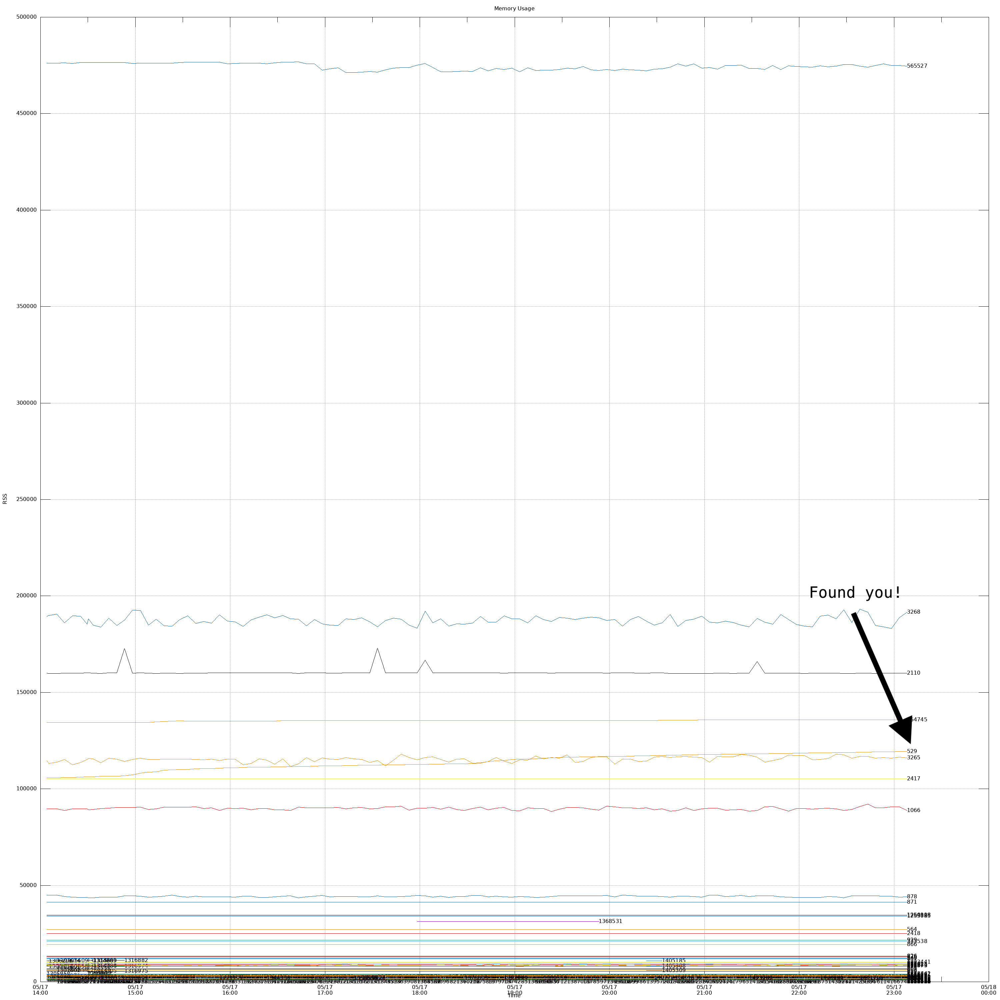

# Memory Leaks

> Utilities to assist you finding processes that are leaking memory on a running system

Here is a preview of the graph generated.



### Usage

You can investigate a process running on your local machine, or deploy the script to a remote machine in a screen session.

Local usage:

```bash
# Start collecting data
just start
```

```bash
# In a separate terminal, you can plot it at any time
just plot

# After you are done, stop the data collection
# And don't forget to clean up after yourself
just clean
```

Remote usage:

```bash
export host=host_name_or_ip_address

 # Start collecting data
just remote-start ${host}

# At anytime pull the data
just remote-download ${host}

# ... and plot it
just plot

# Stop collecting data
just remote-stop ${host}

# Keep your sysadmin happy :)
just remote-clean ${host}

# If you want to peek at the daemons output
just remote-peek ${host}
```

### Requirements

The scripts in this project uses the following versions of the tools, installed locally:

```
GNU bash, version 5.2.15(1)-release (aarch64-apple-darwin22.3.0)
GNU Awk 5.2.1, API 3.2
gnuplot 5.4 patchlevel 6
just 1.13.0
```

If there is any problem with the scripts, please check the versions of the tools you are using.

```bash {cmd}
bash --version | grep 'GNU bash'
awk --version | grep 'GNU Awk'
gnuplot --version
just --version
```

For you convenience, you can start a `nix-shell`

```
~/repos/mem-leak-helpers on master!
$ nix-shell

[nix-shell:~/repos/expelledboy/mem-leak-helpers]$ just
Available recipes:
    remote-start host    # Start a remote daemon to collect memory usage
    remote-peek host     # Peek at the output of the daemon
    remote-stop host     # Stop the remote daemon
    remote-download host # Download the data from the remote host
    remote-clean host    # Purge any files used during the collection
    plot                 # Plot the data and open the graph
```

On the remote host, the following tools are required:
```
bash
cat
date
echo
getopts
grep
mkdir
ps
read
rm
sample
screen
sleep
tar
true
```


If this list is outdated, run the following to get the list of required tools:

```bash {cmd}
just _required-bins
```

### Notes

- So long as you don't delete the data directory on the remote host, you can stop and start the data collection at any time.
- If your host is crashing and clearing the `/tmp` directory, please look through the `./src` and the `Justfile` for how to change the data directory of the daemon.
